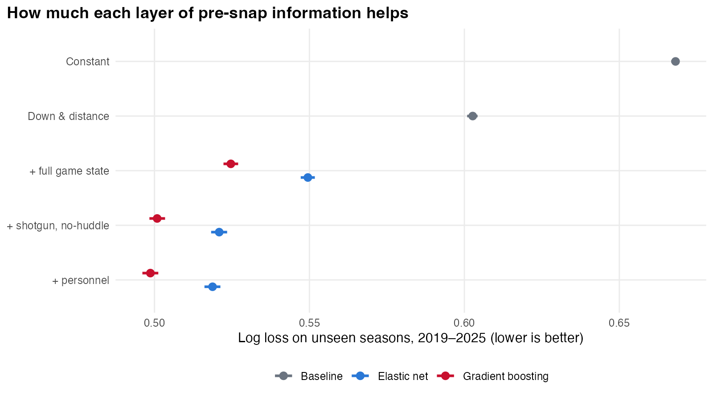
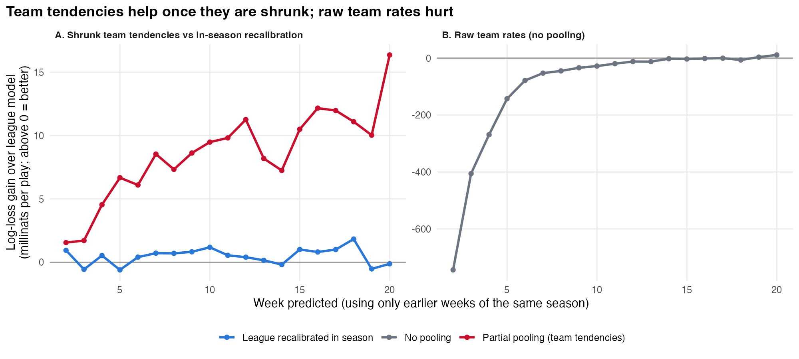
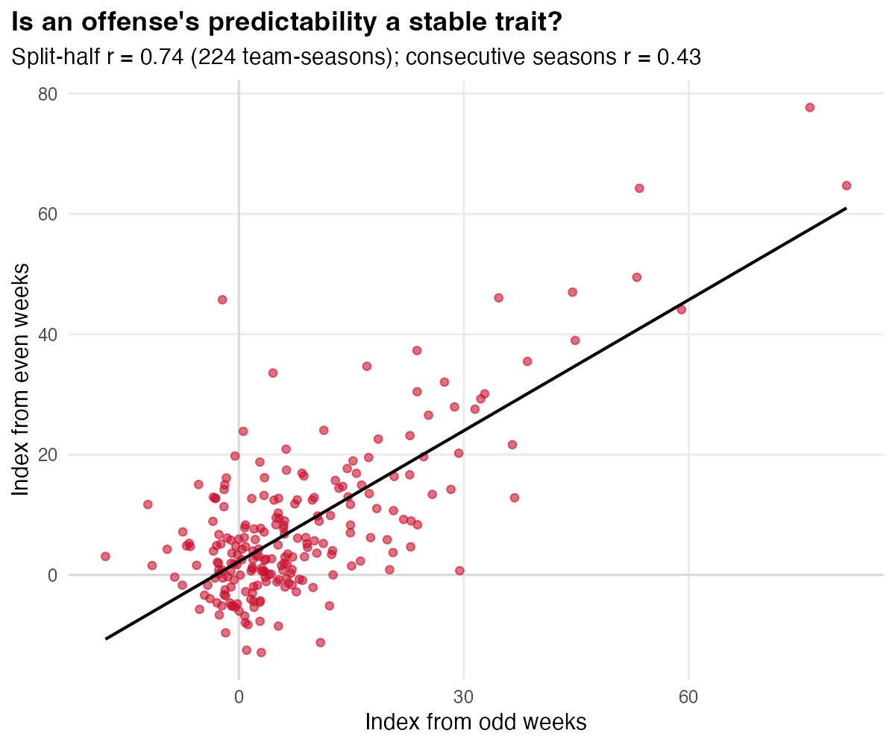
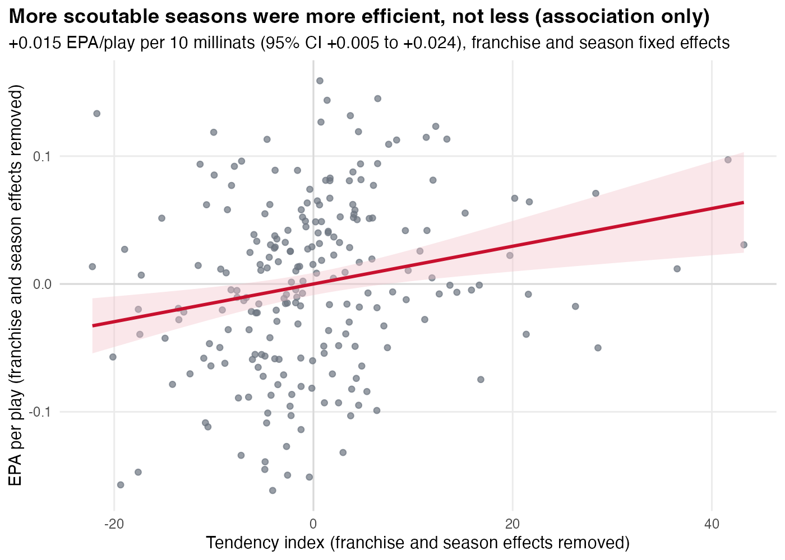

# How predictable is an NFL offense before the snap?

Using only what a defense can see before the snap, this project asks how well run vs pass can be called for a season the model has never seen. It also asks whether each offense gives away more than league norms would suggest, once small samples are handled honestly. The scouting side is an R Shiny app that shows every rate with its play count, shrinks small samples, and flags them.

**Live app:** APP_URL · **No-install version:** [static HTML](reports/static/nfl-presnap-static.html) (download and open) · **Two-page summary:** [PDF](reports/NFL%20Pre-Snap%20Predictability%20-%20Summary.pdf)

**Data:** 342,254 offensive plays from 2016–2025 (nflverse play-by-play, participation and FTN charting). Test seasons are 2019–2025.
**Stack:** R (xgboost, glmnet, lme4, testthat, Shiny + bslib + plotly).

## Findings

**1. Pre-snap information calls about three plays in four correctly on unseen seasons.**
- Guessing "pass" every time is right 61.1% of the time, and down and distance alone get only to 62.5%.
- The full pre-snap model reaches **74.5% accuracy** (95% CI 74.3–74.8%) and an AUC of 0.82, pooled over seven seasons it was never trained on.
- Each season from 2019 to 2025 lands between 73.9% and 75.5%.
- It is well calibrated: the slope is 0.98, and expected calibration error is 1.2 percentage points.



| Information added | Log-loss reduction (millinats per play) | 95% CI |
|---|---|---|
| Down & distance over a constant | 65.5 | 64.1–66.8 |
| Full game state (field position, clock, score, timeouts) | 78.0 | 76.2–79.9 |
| Shotgun and no-huddle | 23.8 | 22.6–25.0 |
| Personnel (RB/TE/WR counts, extra linemen) | 2.2 | 1.7–2.6 |

- **Personnel adds little** once game state and alignment are known. That is a real result, not a missing variable.
- **Gradient boosting beat the elastic net** at every level, by about 20 millinats per play. Both were tuned the same way on a held-out earlier season. The elastic net chose almost no penalty, so its gap comes from the interactions its fixed basis can't represent, not from over-regularization.

**2. Team tendencies help, but only when they are shrunk.**
Each week was predicted using only that team's earlier weeks of the same season, which is what an opponent preparing for that game would know.
- **Partial pooling:** adding the team's own tendencies, shrunk toward the league, improved prediction by **8.2 millinats per play** (95% CI 7.3–9.0).
  - **League-wide drift** (a single in-season recalibration) accounts for only 0.5 of that.
  - **The gain grows through the season**, from about 2 millinats in week 2 to 10–12 by weeks 15–18.
- **Raw team rates** were 109 millinats per play *worse* than ignoring teams altogether. That is the small-sample trap, measured: early in the season raw rates are disastrous, and they only catch up with the league model around week 14, while the shrunk model is ahead from week 2.



**3. How much an offense gives away is a stable trait.**
- **The tendency index** is the per-play gain from knowing a team's own tendencies, measured on held-out weeks.
- **Reliability:**
  - Split-half (odd vs even weeks): r = 0.74 (0.85 after Spearman–Brown correction).
  - The same offense in consecutive seasons: r = 0.43 (95% CI 0.31–0.54, n = 192).
- **The most scoutable offenses** were run-heavy teams with mobile quarterbacks, such as Baltimore 2019–20, Atlanta 2022, Chicago 2022 and Philadelphia 2021–24. They depart from league norms in consistent ways.



**4. More scoutable seasons were more efficient, not less (an association, not a cause).**
- **Primary estimate:** within the same franchise, seasons with a higher tendency index had higher offensive EPA per play: **+0.015 per 10 millinats** (95% CI +0.005 to +0.024; franchise and season fixed effects, standard errors clustered by franchise).
- **Robustness:** it holds without the four most extreme team-seasons (+0.018) and as a rank correlation (Spearman 0.25).
- **The likely explanation is confounding:** the offenses that depart most from league norms are often built around an unusual and effective quarterback.
- **Not ruled out:** roster quality, game script, opponents and coaching changes. An efficient offense may simply have less reason to disguise what it does. This is a description, not advice to be predictable.
- **Exploratory, play level:** calls that were surprising under the team-aware model went with higher EPA, for runs (+0.10 for a fully surprising call) and passes (+0.08).



**5. Charted formation detail matters a lot (exploratory, 2024–25).**
- **The test:** adding FTN's charted pre-snap fields (2022 onward) to the full model.
- **The gain:** log loss fell by **33 millinats per play** (95% CI 30–37), and accuracy rose from 74.1% to 77.1%.
- **What drives it:** a drop-one ablation traced the gain to two pre-snap fields.
  - **Pistol alignment (16 millinats):** pistol plays pass about a quarter of the time, against nearly 80% from true shotgun. The play-by-play "shotgun" flag counts pistol as shotgun.
  - **Backfield count (12 millinats):** an empty backfield passes 95% of the time, two backs 33%.
- **What it means:** the main analysis understates how predictable offenses are, because consistent formation detail only exists in public data from 2022.

## How it was built

1. **Data audit first** ([DATA_AUDIT.md](DATA_AUDIT.md)).
   - **Completeness:** every completed game on the schedule (2,761) has play-by-play.
   - **What counts as pre-snap:** decided field by field. Play action, RPO and screen flags are post-snap and excluded. So is defensive alignment, which is the defense's response to the offense.
   - **Source change:** in 2023 the participation data switched from NFL Next Gen Stats to FTN. Formation labels aren't comparable across the change, so they were dropped. Personnel strings in both formats were parsed to the same counts, which show no break at the switch.
   - **Model-derived features:** nflfastR's `ep` and `wp` are excluded, because they were fit on outcomes from many seasons, including the test seasons.
2. **A frozen analysis plan** ([ANALYSIS_PLAN.md](ANALYSIS_PLAN.md)), committed before any model of run vs pass was fit. Every later change is in [DEVIATIONS.md](DEVIATIONS.md), including the checks added after seeing results:
   - in-season recalibration
   - the FTN ablation
   - the Q3 outlier check
3. **Temporal validation only.**
   - **League models:** train on earlier seasons, tune on the latest training season, test on the next. Random splits would put plays from the same game on both sides.
   - **Team models:** each week is predicted from earlier weeks only, and a test checks this.
4. **Uncertainty:** game-cluster bootstrap (1,000 resamples within each season) for every pooled comparison.
5. **Shrinkage:** team tendencies use random intercepts (`lme4`) for team, team × situation, team × personnel group and team × alignment, with the league prediction as an offset.
6. **Engineering:**
   - 38 `testthat` checks, covering betting columns, post-snap fields, encoding fixed on training data only, held-out outcome corruption and the walk-forward check
   - pinned packages (`renv.lock`)
   - data files pinned by SHA-256, because nflverse updates releases in place

## The app

| Tab | What it shows |
|---|---|
| Scout | A team's pass rate by down and distance, personnel or alignment: raw, league expected for the same plays, and the shrunk team estimate with a 95% interval. Cells under 30 plays are flagged. |
| Self-scout | The biggest departures from league norms that the data can tell apart from noise, written as plain sentences |
| Predictability | Every offense's tendency index with intervals, plus the league model's calibration on the held-out season |
| Third down | Third-down tendencies by distance and target shares |

"League expected" comes from the model trained on earlier seasons, so a deviation means a tendency beyond what the game situation implies. Scouting tables are fit on full seasons and are descriptive. All predictive claims above come from held-out tests.

## Limitations

- **Formation detail:** consistent formation detail is only available from 2022 (finding 5). Earlier seasons rely on the shotgun flag and personnel.
- **Personnel positions:** personnel uses roster positions, so a lineman reporting as a tight end counts as a lineman.
- **Tuning grid:** boosting usually chose the deepest trees and slowest learning rate in its grid. A wider grid could widen its lead over the elastic net, but would not change any conclusion.
- **League drift:** the league model slightly over-predicts passing in recent seasons (calibration intercept −0.07), as the league passed a bit less.
- **App intervals:** they treat the league model as known, so they are slightly too narrow.
- **Q3:** it is an association, with the confounders listed above.

## Reproduce

```bash
Rscript scripts/00_fetch_data.R      # download nflverse files, verify against data/manifest.csv
Rscript scripts/01_data_audit.R
Rscript scripts/02_q1_league.R       # about 35 minutes on 8 cores
Rscript scripts/02b_q1b_ftn.R
Rscript scripts/03_q2_team.R
Rscript scripts/04_q3_efficiency.R
Rscript scripts/05_app_data.R
Rscript scripts/06_figures.R
Rscript tests/run_tests.R
Rscript -e "shiny::runApp('app')"
```

R 4.5. Restore pinned packages with `renv::restore()`.

## Data and license

- **Data:**
  - nflverse play-by-play (CC BY 4.0).
  - Participation from NFL Next Gen Stats through 2022 and FTN Data from 2023, via nflverse (CC BY-SA 4.0).
  - FTN charting, "FTN Data via nflverse" (CC BY-SA 4.0).
- **License of this repository:** derived tables, figures and app data are CC BY-SA 4.0. Code is MIT. Raw data is not redistributed.
- **No betting data:** betting-line columns in the source data are never read.
- **Affiliation:** not affiliated with or endorsed by the NFL, nflverse or FTN.
